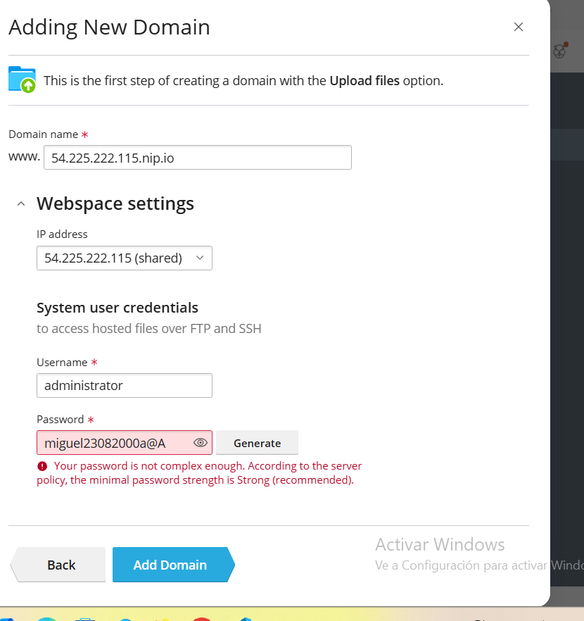

# practica-8.1

## 1.Creación de una instancia en aws

Primero vamos a  crear un grupo de seguridad con las siguientes caracteristicas

Reglas de entrada 22: SSH (TCP),80: HTTP (TCP),443: HTTPS (TCP),ICMP,8443: (TCP)

Reglas de salida

permitir todo el tráfico de salida para cualquier dirección IP

Una vez hecho esto crearemos una instancia con las siguientes caracteristicas y le asignaremos una Ip elastica Nombre de la instancia: plesk. Imagen (AMI): Última versión disponible de Ubuntu Server. Arquitectura: x86. Tipo de instancia: t2.medium (2 vCPUs, 4 GB de RAM). Par de claves: yo pondre la mi de recuperacion2.pem. Grupo de seguridad: Crear un grupo de seguridad para plesk. Almacenamiento: 30 GB de disco EBS.

## 2.Instalación de plesk

Nosotros lo vamos a hacer de manera desatendida,para ello,Como root o con un usuario con permisos de sudo, ejecute los siguientes comandos:

1.Descargue el script de instalación desatendida de Plesk.
wget https://autoinstall.plesk.com/plesk-installer

2.Le asignamos permisos de ejecución al script.
chmod +x plesk-installer 

3.Ejecutamos el script de instalación.
./plesk-installer install plesk

## 3.Gestión de dominios y subdominios en plesk
Accederemos a los sitios sin modificar los archivos en nuestra máquina local,vamos a usar nip.io,un servicio dns wildcard.

## Ahora vamos a craer un dominio en plesk
Lo primero que haremos será crear un dominio para nuestra ip,para ello,accedemos a Websites & Domains y y seleccionamos Add Domain

nos creará el Dominio con www por defecto para quitarlo iremos a Hosting Settings y en Preferred domain elegiremos el dominio sin el encabezado wwww

## Crear certificado para el dominio
entraremos en la pestaña de SSL/TLS Certificates desde el Dashboard del dominio que hemos creado y selecionamos lets encrypt

Alactivarlo podremos ver que nuestro sitio es seguro
